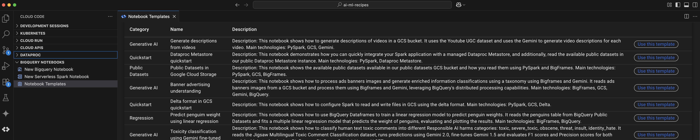
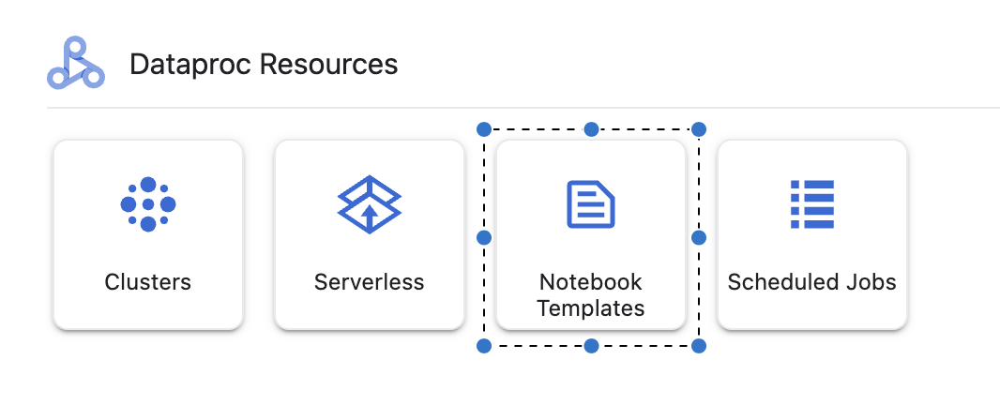
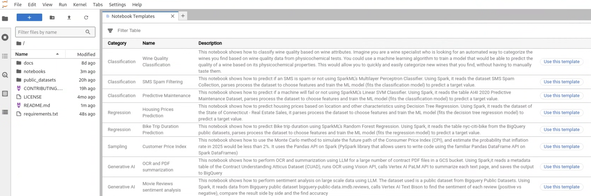

# AI/ML Recipes for Vertex AI, Serverless Spark and BigQuery

AI/ML Recipes for Vertex AI, Serverless Spark and BigQuery open-source project is an effort to jumpstart your development of data processing and machine learning notebooks using VertexAI, BigQuery and Dataproc's distributed processing capabilities.

We are release a set of machine learning focused notebooks, for you to adapt, extend, and use to solve your use cases using your own data.  
You can easily clone the repo and start executing the notebooks right way using your Dataproc cluster or Dataproc Serverless Runtime for the PySpark notebooks, and any environment for the [BigQuery Dataframes](https://cloud.google.com/python/docs/reference/bigframes/latest) (Bigframes) notebooks.

[](https://console.cloud.google.com/cloudshell/editor)

## Notebooks
Please refer to each notebooks folder documentation for more information:

| Title | Industry | Topic | Sub Topic | Main Technologies |
|-------|----------|-------|-----------|----------------|
| [Fine-tuning Gemini to translate multiple languages](./notebooks/generative_ai/finetuning/translation_finetuning.ipynb) | Media & Entertainment | Generative AI | Fine tuning | PySpark, Iceberg. Gemini |
| [PDF summarization using Gemini](./notebooks/generative_ai/summarization/pdf_contracts_summarization.ipynb) | Financial | Generative AI | Summarization | PySpark, SparkML, Gemini, BigQuery |
| [Movie Reviews sentiment analysis using Gemini](./notebooks/generative_ai/sentiment_analysis/sentiment_analysis_movie_reviews.ipynb) | Media & Entertainment | Generative AI | Sentiment Analysis | PySpark, SparkML, Gemini, BigQuery |
| [Generate description from videos](./notebooks/generative_ai/content_generation/description_from_video.ipynb) | Retail | Generative AI | Content Generation | PySpark, GCS, Gemini |
| [Product attributes and description from image](./notebooks/generative_ai/content_generation/product_attributes_from_image.ipynb) | Retail | Generative AI | Content Generation | PySpark, GCS, Gemini |
| [SMS Spam Filtering](./notebooks/classification/multilayer_perceptron_classifier/sms_spam_filtering.ipynb) | Telecom | Classification | Multilayer Perceptron Classifier | PySpark, Spark ML, GCS |
| [Predictive Maintenance](./notebooks/classification/linear_support_vector_machine/predictive_maintenance.ipynb) | Manufacturing | Classification | Linear Support Vector Machine | PySpark, Spark ML, GCS |
| [Wine Quality Classification](./notebooks/classification/logistic_regression/wine_quality_classification_mlr.ipynb) | Retail | Classification | Logistic Regression | PySpark, Spark ML, GCS |
| [Housing Prices Prediction](./notebooks/regression/decision_tree_regression/housing_prices_prediction.ipynb) | Financial | Regression | Decision Tree Regression | PySpark, Spark ML, GCS |
| [Bike Trip Duration Prediction](./notebooks/regression/random_forest_regression/bike_trip_duration_prediction.ipynb) | Mobility | Regression | Random Forest Regression | PySpark, Spark ML, BigQuery |
| [Customer Price Index](./notebooks/sampling/monte_carlo/customer_price_index.ipynb) | Financial | Sampling | Monte Carlo method | PySpark, GCS, NumPy |
| [Banner advertising understanding](./notebooks/generative_ai/content_generation/banner_advertising_understanding.ipynb) | Retail | Generative AI | Content Generation | BigFrames, GCS, Gemini, BigQuery |
| [Predict penguim weight](./notebooks/regression/linear_regression/penguim_weight_prediction.ipynb) | Environmental | Regression | Linear Regression | BigFrames, BigQuery |
| [Toxicity classification using Gemini fine-tuned](./notebooks/generative_ai/classification/toxicity_classification.ipynb) | Gaming | Generative AI | Classification | BigFrames, Gemini, Vertex AI |
| [Contract Risk and Compliance Review](./notebooks/generative_ai/summarization/automated_contract_risk_and_compliance_review.ipynb) | Financial | Generative AI | Summarization | BigQuery, SQL, Gemini |
| [Asset Price Forecast using Iceberg and Prophet](./notebooks/forecast/asset_price_forecast.ipynb) | Finance | Forecast | Prophet | PySpark, Dataproc Serverless, Apache Iceberg, Prophet, BigQuery, GCS |
| [Purchase Predictions with PySpark in BigQuery Studio](./notebooks/analytics/purchase_predictions_spark.ipynb) | Retail | Analytics | Purchase Predictions | PySpark, Spark ML, BigQuery, Dataproc, GCS |
| [Time Series Analysis with TimesFM and ARIMA in BigQuery](./notebooks/forecast/arima_timesfm_bigquery.ipynb) | Retail | Forecast | ARIMA and TimesFM | BigQuery, BigQuery ML, ARIMA, TimesFM, Python, Matplotlib |
| [Assessing Environmental Risks to Protect Agricultural Investments](./notebooks/quickstart/geospatial/assessing_risks_geospatial_bqml.ipynb) | Agriculture | Quickstart | Geospatial | BigQuery, Google Earth Engine, BigFrames, GeoPandas, BigQuery ML |
| [A Data Science Approach to Investigating Poor Product Sales Performance](./notebooks/analytics/Investigating Poor Product Sales.ipynb) | Retail | Analytics | Sales Performance Analysis | BigQuery, Vertex AI, Pandas, scikit-learn, XGBoost, Matplotlib, Seaborn |
| [A Data Science Approach to Investigating Poor Product Sales Performance](./notebooks/analytics/investigating_poor_product_sales.ipynb) | Retail | Analytics | Sales Performance Analysis | BigQuery, Vertex AI, XGBoost, Pandas, Google AI Query Engine, Data Science Agent |


Google Cloud products quickstarts:

| Title | Topic | Sub Topic | Main Technologies |
|-------|-------|-----------|----------------|
| [Delta format in GCS Quickstart](./notebooks/quickstart/delta_format/delta_quickstart.ipynb) | Quickstart | Delta | PySpark, GCS, Delta |
| [Dataproc Metastore](./notebooks/quickstart/dataproc_metastore/metastore_spark_quickstart.ipynb) | Quickstart | Dataproc Metastore | PySpark, Dataproc Metastore |
| [Dataproc cluster insights with BigQuery](./notebooks/analytics/dataproc_cluster_insights_bigquery.ipynb) | Quickstart | Dataproc | BigQuery, Dataproc |
| [Bigframes Quickstart](./notebooks/quickstart/bigframes/bigframes_quickstart.ipynb) |  Quickstart | Bigframes | BigFrames, BigQuery, Gemini |
| [Apache Iceberg on BQ Quickstart](./notebooks/quickstart/iceberg/iceberg_quickstart.ipynb) | Quickstart | Iceberg | BigQuery, Apache Iceberg |
| [Agent2Agent Quickstart](./notebooks/quickstart/agent2agent/a2a_quickstart.ipynb) | Quickstart | Agent2Agent | Gemini, Google ADK, A2A, Vertex AI |

## Public Datasets
The notebooks read datasets from our public GCS bucket containing several publicly available datasets.

In this [doc](./public_datasets/public_datasets.ipynb) you can see the list of available datasets, which are located in [gs://dataproc-metastore-public-binaries](https://console.cloud.google.com/storage/browser/dataproc-metastore-public-binaries).  
The documentation above has details about the datasets, and links to their original pages, containing their LICENSES, etc.

### Cloud Code VSCode extension

These notebooks are available from your VSCode IDE when using the [Cloud Code extension](https://cloud.google.com/code/docs/vscode). You can go to **Notebook Templates** and download each template to your environment:



### Usage in Vertex AI Workbench notebooks

These notebooks are available from within the Vertex AI Workbench notebooks environment.  
Navigate to JupyterLab home screen and click on Notebooks to see the list of notebooks and a button for you to download/copy them into your environment.


<br>


## Usage in your local environment

1) Install [gcloud cli](https://cloud.google.com/sdk/docs/install)
2) Run `gcloud init` to setup your default GCP configuration
3) Clone this repository by running  
   ```git clone https://github.com/GoogleCloudPlatform/ai-ml-recipes.git```
4) Install requirements by running ```pip install -r requirements.txt```
5) For the **PySpark notebooks**, use one of the approaches using the *Dataproc Jupyter Plugin*:
    - 5.1) [*PySpark Serverless Runtime on Google Cloud*] Create a *[Runtime Template](https://cloud.google.com/dataproc-serverless/docs/guides/create-serverless-sessions-templates)* with your desired runtime config, and use it to run your PySpark notebooks.
        - Do not forget to ensure the correct network [configuration](https://cloud.google.com/dataproc-serverless/docs/concepts/network) 
    - 5.2) [*Local runtime*] Use your local PySpark runtime
6) For the **Bigframes notebooks**, you do not need PySpark, just any kernel/environment, and the processing will leverage BigQuery in your GCP project


#### BigQuery Jupyter Plugin

We recommend leveraging the [BigQuery Jupyter Plugin](https://github.com/GoogleCloudDataproc/dataproc-jupyter-plugin), which will be available in your local environment just by installing the dependency running ```pip install -r requirements.txt```. This will enable you to:

- Connect your Jupyterlab notebooks from anywhere to Dataproc
- Develop in Python, SQL, Java/Scala, and R
- Manage Dataproc clusters and jobs
- Run notebooks in your favorite IDE that supports Jupyter using Dataproc as kernel
- Deploy a notebook as a recurring job
- View cloud and spark logs inside Jupyterlab
- View your BigQuery datasets schema inside Jupyterlab
- Manage your files on Google Cloud Storage (GCS)

## Contributing
See the contributing [instructions](./CONTRIBUTING.md) to get started contributing.

## License
All solutions within this repository are provided under the [Apache 2.0](https://www.apache.org/licenses/LICENSE-2.0) license. Please see the [LICENSE](/LICENSE) file for more detailed terms and conditions.

## Disclaimer
This repository and its contents are not an official Google Product.

## Contact
Questions, issues, and comments can be raised via Github issues.
