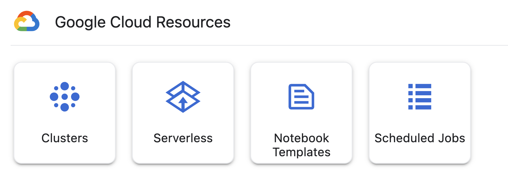

# AI/ML Recipes Repo for Vertex AI, BigQuery, and Spark

AI/ML Recipes Repo for Vertex AI, BigQuery, and Spark open-source project is an effort to assist customers to jumpstart the development of data processing and machine learning notebooks using VertexAI, BigQuery and Dataproc's distributed processing capabilities.

We are release a set of machine learning focused notebooks, for you to adapt, extend, and use to solve your use cases using your own data.  
You can easily clone the repo and start executing the notebooks right way using your Dataproc cluster or Dataproc Serverless Runtime for the PySpark notebooks, and any environment for the [BigQuery Dataframes](https://cloud.google.com/python/docs/reference/bigframes/latest) (Bigframes) notebooks.

[](https://console.cloud.google.com/cloudshell/editor)

## Notebooks
Please refer to each notebooks folder documentation for more information:

**PySpark**
* Classification
    * Logistic Regression
        * [Wine Quality Classification](./classification/logistic_regression/wine_quality_classification_mlr.ipynb)
    * Multilayer Perceptron Classifier
        * [SMS Spam Filtering](./classification/multilayer_perceptron_classifier/sms_spam_filtering.ipynb)
    * Linear Support Vector Machine
        * [Predictive Maintenance](./classification/linear_support_vector_machine/predictive_maintenance.ipynb)
* Regression
    * Decision Tree Regression
        * [Housing Prices Prediction](./regression/decision_tree_regression/housing_prices_prediction.ipynb)
    * Random Forest Regression
        * [Bike Trip Duration Prediction](./regression/random_forest_regression/bike_trip_duration_prediction.ipynb)
* Sampling
    * Monte Carlo method
        * [Customer Price Index](./sampling/monte_carlo/customer_price_index.ipynb)
* Generative AI
    * Summarization
        * [OCR and PDF summarization using LLM](generative_ai/summarization/ocr_contract_summarization_llm.ipynb)
    * Sentiment Analysis
        * [Movie Reviews sentiment analysis using LLM](generative_ai/sentiment_analysis/sentiment_analysis_movie_reviews.ipynb)
    * Content Generation
        * [Product attributes and description from image](generative_ai/content_generation/product_attributes_from_image.ipynb)
        * [Generate description from videos](generative_ai/content_generation/description_from_video.ipynb)

**BigFrames (BigQuery Dataframes)**
* Generative AI
    * [Banner advertising understanding](generative_ai/content_generation/banner_advertising_understanding.ipynb)
    * [Museum Art Translation Using Claude](https://github.com/googleapis/python-bigquery-dataframes/blob/main/notebooks/generative_ai/bq_dataframes_llm_claude3_museum_art.ipynb)


## Public Datasets
The notebooks read datasets from our public GCS bucket containing several publicly available datasets.

In this [doc](./public_datasets/public_datasets.ipynb) you can see the list of available datasets, which are located in [gs://dataproc-metastore-public-binaries](https://console.cloud.google.com/storage/browser/dataproc-metastore-public-binaries).  
The documentation above has details about the datasets, and links to their original pages, containing their LICENSES, etc.


### Usage in Vertex AI Workbench notebooks

These notebooks are available from within the Vertex AI Workbench notebooks environment.  
Navigate to JupyterLab home screen and click on Notebooks to see the list of notebooks and a button for you to download/copy them into your environment.



## Usage in your local environment

1) Install [gcloud cli](https://cloud.google.com/sdk/docs/install)
2) Run ```gclout init``` to setup your default GCP configuration
3) Clone this repository by running  
   ```git clone https://github.com/GoogleCloudPlatform/dataproc-ml-quickstart-notebooks.git```
4) Install requirements by running ```pip install -r requirements.txt```
5) For the **PySpark notebooks**, use one of the approaches using the *Dataproc Jupyter Plugin*:
    - 5.1) [*Recommended*] Create *Dataproc Serverless Notebooks*, after creating a *Runtime Template* with your desired Dataproc config, and use it as a Jupyter kernel when executing the notebooks
        - Do not forget to ensure the correct network [configuration](https://cloud.google.com/dataproc-serverless/docs/concepts/network) (for example, you need a Cloud NAT to be able to install packages from the public PyPI)
    - 5.2) Create a *Dataproc Cluster* with your desired Dataproc config, and use it as a Jupyter kernel when executing the notebooks
6) For the **Bigframes notebooks**, you do not need PySpark, just any kernel/environment, and the processing will leverage BigQuery in your GCP project


### Dataproc Jupyter Plugin

We recommend leveraging the [Dataproc Jupyter Plugin](https://github.com/GoogleCloudDataproc/dataproc-jupyter-plugin), which will be available in your local environment just by installing the dependency running ```pip install -r requirements.txt```. This will enable you to:

- Connect your Jupyterlab notebooks from anywhere to Dataproc
- Develop in Python, SQL, Java/Scala, and R
- Get started within minutes with minimal setup
- Troubleshoot your Spark code inside Jupyterlab
- Manage Dataproc clusters and jobs
- Run notebooks in your favorite IDE that supports Jupyter using Dataproc as kernel

## Contributing
See the contributing [instructions](./CONTRIBUTING.md) to get started contributing.

## License
All solutions within this repository are provided under the [Apache 2.0](https://www.apache.org/licenses/LICENSE-2.0) license. Please see the [LICENSE](/LICENSE) file for more detailed terms and conditions.

## Disclaimer
This repository and its contents are not an official Google Product.

## Contact
Questions, issues, and comments can be raised via Github issues.